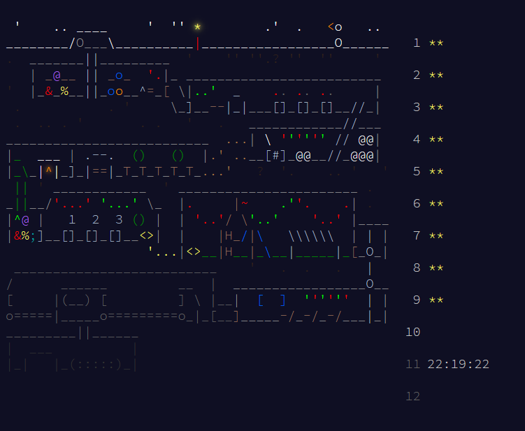

Trying to do advent of code in rust

enjoy the slop

## Day Records

*Note: Timings do not include file I/O*

| Day | Part 1           | Part 2           | Time                |
|-----|------------------|------------------|---------------------|
| 1   | 1036             | 6228             | 0ns/0ns             |
| 2   | 38437576669      | 49046150754      | 169.639ms/400.423ms |
| 3   | 17158            | 170449335646486  | 533μs/539μs         |
| 4   | 1493             | 9194             | 283μs/1.948ms       |
| 5   | 770              | 357674099117260  | 586μs/245μs         |
| 6   | 4364617236318    | 9077004354241    | 195μs/195μs         |
| 7   | 1570             | 15118009521693   | 194μs/147μs         |
| 8   | 175440           | 3200955921       | 212μs/139μs         |
| 9   | 4755278336       | 1534043700       | 236μs/138ms         |
| 10  | -                | -                | -/-                 |
| 11  | -                | -                | -/-                 |
| 12  | -                | -                | -/-                 |
